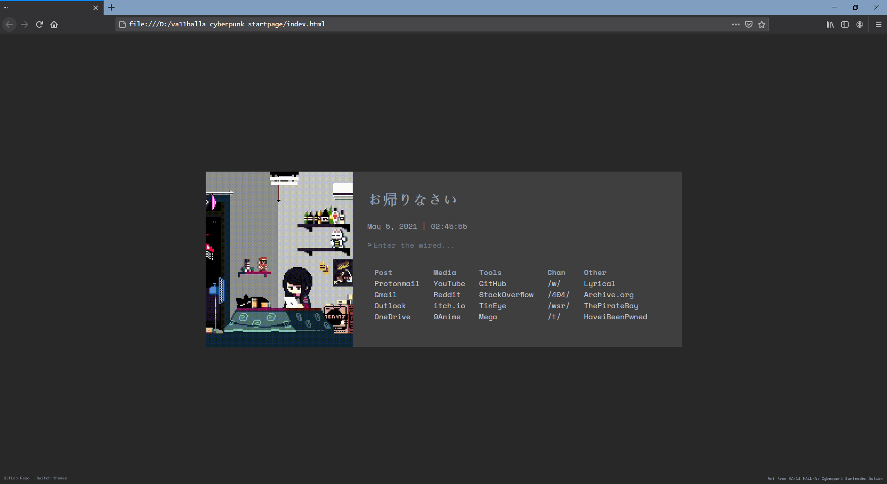
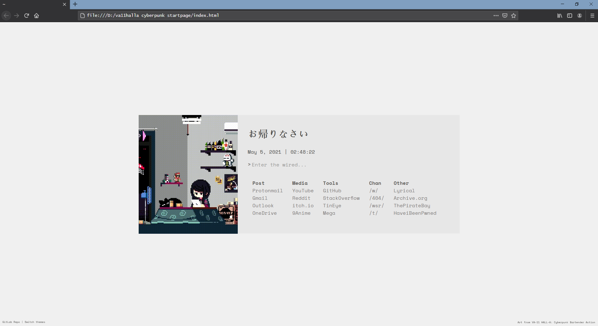

# VA-11 HALL-A: Cyberpunk Bartender Action startpage
This is my first startpage, a random project made after seeing some basic tutorials, it is heavily inspired by [this one](https://gitlab.com/wolfiy/wlfys-minimal-startpage). This startpage is made from scratch, but following wolfiy's design.

## Use
You can use the startpage in FireFox and Chrome as well. It seems that is funcionating on Opera Browser, but it might take more work implementing it.

## Credits
Inspired from [wolfiy's startpage](https://gitlab.com/wolfiy/wlfys-minimal-startpage).
The art is from [VA-11 HALL-A: Cyberpunk Bartender Action](https://store.steampowered.com/app/447530/VA11_HallA_Cyberpunk_Bartender_Action/), developed by [Sukeban Games](http://sukeban.moe).
